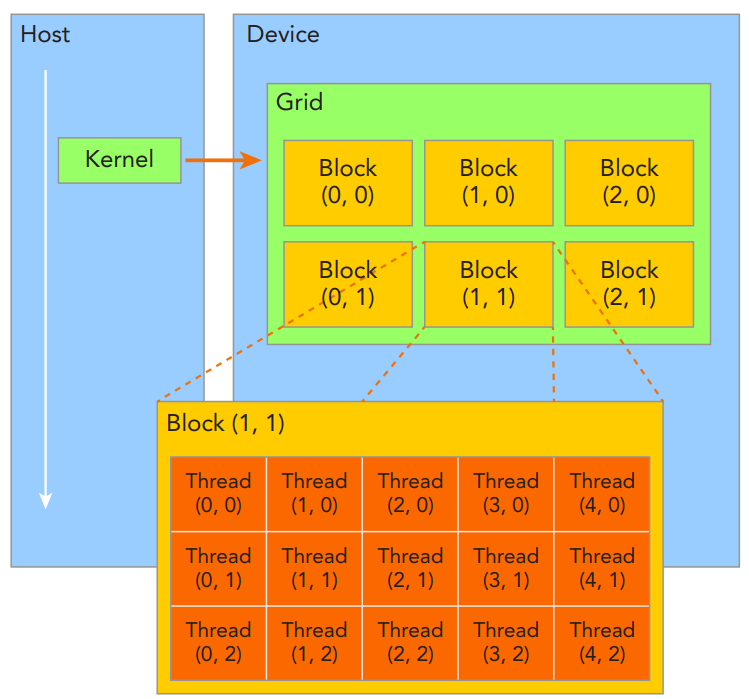

# These are my notes for CUDA 

👋 Basic idea of CUDA is that, using CUDA, we can send a time consuming portion of our code in CPU to the GPU, so that this portion of the calculation will utilize the parallelization capability of the GPU. After the calculation, we will copy back the result from the GPU to our CPU.  

## Pre requisite: </br>

HARDWARE:</br> 
If you have Nvidia's GPU in your system, install `nvcc`, the CUDA compiler. If not, to practice CUDA, you can go to Google Collab and utilise T4 GPU for free by going to `change runtime type`, `Hardware accelerator` : `T4 GPU` </br>
</br>
Note that usage of this T4 GPU in Google Collab is limited. It can only be used for small calculations. If it is ON for too long without usage, Google will STOP your usage of this GPU for some hours.</br>

PROGRAMMING: </br>
C: functions, pointers


## GPU architecture


* In a very naive way, we can say a GPU as a whole is a Grid
* The GPU grid is divided into multiple blocks. Each block has multiple threads. The maximum number of threads a block can have is 1024.
* There are two types of memory inside a GPU: shared memory and global memory.
* Most of the time we will use global memory. Shared memory will be used in very special occasions.


## `Hello World!` program

First lets write a C program that runs on CPU. Since I am writing the code in google collab. So, putting `%%writefile prog.c` at the top of a cell in Google Colab will write the contents of that cell as `prog.c` in Files.
```
%%writefile hello.c

#include <stdio.h>

int main(){
   printf("Hello World! \n");
   return 0;
}
```

Compile (`!` mark is needed in Google Collab) 
```
! gcc -o exe hello.c
! ./exe
```

Now, lets write the same thing as a CUDA program. CUDA programs have extension `.cu` </br> 
CPU is referred as Host and GPU is referred as Device. </br>
When someone says 'device function', they are referring to the function written to run in GPU.  
A cuda program has two parts: Host code part and Device code part.

```
%%writefile prog.cu

#include <stdio.h>
#include <cuda_runtime.h>

__global__ void print_text(){                   
    printf("Hello from GPU! \n");
}


__host__ int main(){

   print_text<<<1,1>>>();             // calling the GPU function from the Host
   CudaDeviceSynchronize();
   printf("Hello from CPU! \n");
   return 0;
}
```
Compile in google collab using 
```
! nvcc -o exe prog.cu
! ./exe
```

Explanation:
* `__global__`, `__host__` are called qualifiers.
* `__global__` qualifier denotes that the function is written for the GPU. The calculation inside this function will be done in the GPU. It must always have a void return type.
* Here, we are printing `Hello from GPU!` from the GPU
* `print_text()` is a function, just how you make a normal function in C. Here, it is a device function.
* `__host__` qualifier denotes that the function will run in the CPU. It contains the main function of the usual C program.
* In the `main()` function, we call the `print_text()` device function using `<<<gridDim, blockDim>>>`
* `gridDim` = Number of blocks in the GPU, `blockDim` = Number of threads in a block.
* In our example, we have sent our device function to 1 block and 1 thread in the block by calling print_text<<<1,1>>>().
* Now, the calculation has gone to the device/GPU. The GPU prints 'Hello from GPU'. 
* `CudaDeviceSynchronize` is used in the host to wait for the GPU to complete its task. After GPU's task is complete, CPU will progress further, like for example, in our case print the text 'Hello from CPU'.   

## Adding two array program


<!---

## Static global memory variables

* Create static variable using the qualifier __device__
* The unique thing about static variable is that it does not require a cudaMalloc(). The variable is accessible by both device function and host function.
--->
